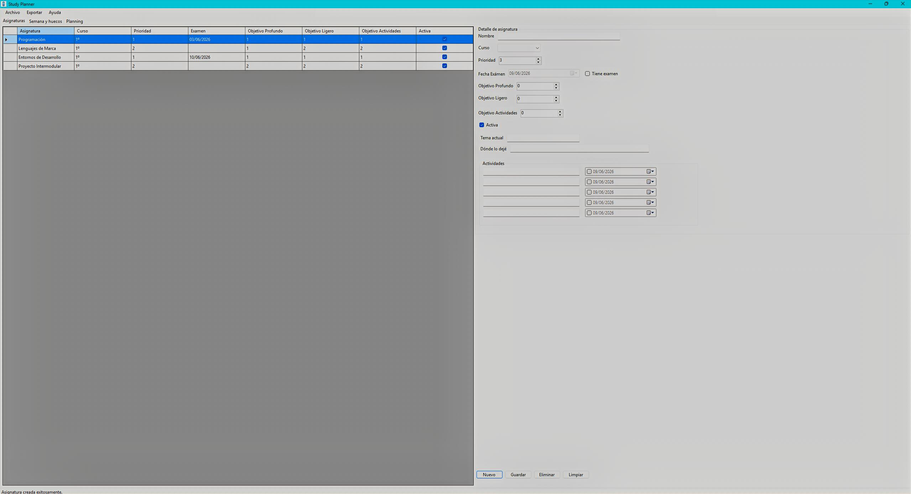
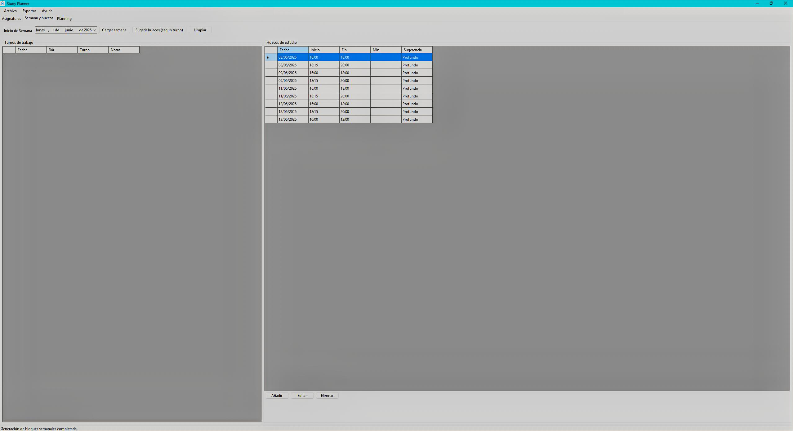
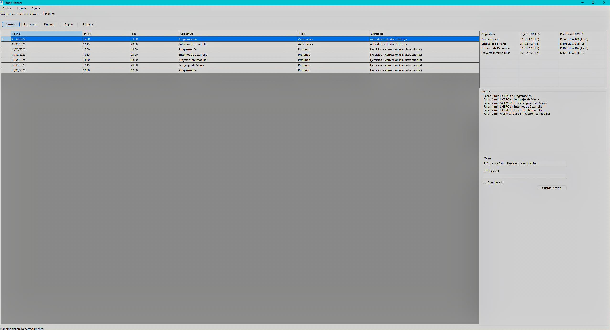

# Study Planner (WinForms)

An Intelligent academic desktop planner developed in C# and Windows Forms, designed to optimize study sessions based on available time blocks, subject priorities, and upcoming deadlines.

> **Portfolio Note:** This repository is currently showing **Version 1.0 (Baseline)**. It represents the functional core of the application before the UI/UX refactoring and code optimization phase. 

---

## Application Preview (Version 1.0)

### 1. Main Dashboard & Subject Management
This section handles the CRUD operations for academic subjects, setting priorities, and listing assignment due dates.



### 2. Time Slots & Work Shifts Setup
Where the user manually inputs available study slots or automatically generates them by selecting their work shift rotation.



### 3. Dynamic Planning & Performance Summary
The core engine output. It distributes study sessions and displays a weekly analytics summary comparing target hours vs. actual allocated time.



---

## Key Features (Current V1.0)

* **Subject Lifecycle (CRUD):** Custom priority scales, exam tracking, and automated focus strategy recommendations.
* **Smart Time-Blocking:** Custom validation rules to prevent geometric overlaps or negative time ranges.
* **Data-Driven Scheduling:** Core planning algorithm that matches user free time with subject weight and urgency.
* **Local Persistence:** Full serialization and deserialization using native `System.Text.Json`.
* **Asynchronous-Ready Layouts:** Decoupled UI logic leveraging bi-directional `BindingSource` and `BindingList`.

---

## Technologies & Tools

| Technology / Tool | Purpose |
| :--- | :--- |
| **C# (.NET)** | Main programming language & business logic. |
| **WinForms** | Desktop User Interface framework. |
| **System.Text.Json** | Local flat-file data persistence. |
| **LINQ** | Declarative queries for time calculation and filtering. |
| **Git / GitHub** | Version control and branch management. |
| **Visual Studio 2022** | Primary Integrated Development Environment (IDE). |

---

## Academic & Portfolio Goals

This project represents a real-world bridge between classroom theory and production-ready practices. It showcases:
1. **Advanced Data Binding:** Moving away from manual grid painting to reactive, data-bound UI components.
2. **Algorithmic Optimization:** Translating time constraints into a structured mathematical distribution without manual loops.
3. **Local Architecture:** Implementation of POO models and controllers mimicking an N-Tier architecture locally.

---

## Quick Start / Installation

### Prerequisites
* Windows 10 / 11
* .NET SDK 6.0 or higher (or .NET Runtime)

### Running it locally
1. Clone the repository:
   ```bash
   git clone [https://github.com/tu-usuario/StudyPlannerWinForms.git](https://github.com/tu-usuario/StudyPlannerWinForms.git)